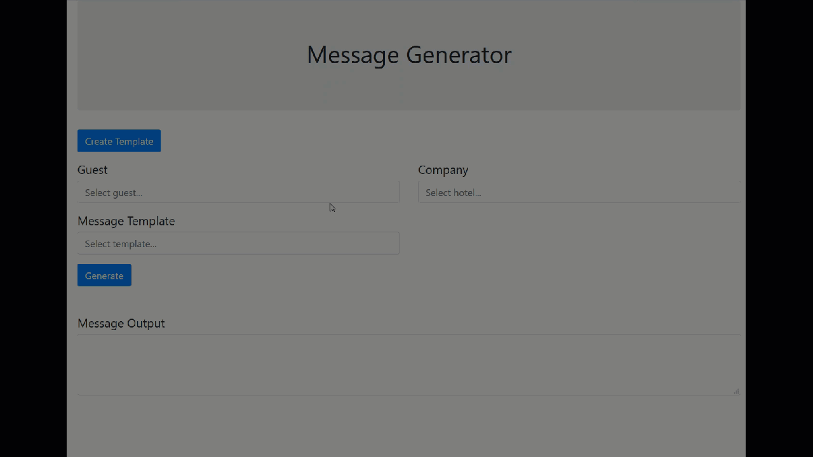

## Table of Contents

- [Instructions](#instructions)
- [Design Decisions](#design-decisions)
- [Language Selection](#language)
- [Testing](#testing)
- [Future Enhancements](#future-enhancements)

## Instructions

Users can generate a message from an existing template or create their own.

Clone the repo and run the install and start commands

* `npm i`
* `npm start`

1) Existing Template

 

2) Create a New Template

 

## Design Decisions

React

I thought React was a good choice of ui library for this project because it provides a simple solution to display a dynamically assembled output. User input is saved to state values, processed on form submit, and the final dynamically created message is saved
to the state as well.  With the state changes, React takes care of updating the UI 

(This choice did create a hiccup in the end where the template options list does not automatically update with the addition of a new template, but that could be addressed with some extra work.  If you refresh the page and create a new template before selecting anything in the template options, then the new template will display.)

Template Data Format

My goal for the template data format was to create something succinct with no restrictions on template design.  In the following format the sequence is populated by keywords that identify a data value or custom text, and the text array holds the custom text values.  As a message is assembled it iterates through the sequence and either inputs the data value or the next custom text value in the text array.

```js
[
  {
    "id": 1,
    "name": "Welcome",
    "sequence": ["greeting", "text", "firstName", "text", "company", "text", "roomNumber", "text"],
    "text": [" ",", and welcome to ","! Room "," is now ready for you.  Enjoy your stay, and let us know if you need anything"]
  }
]

```

UI and Packages

I used ReactBootstrap for a simple front end template, luxon for getting the current time in the timezone of the hotel selected, and react-bootstrap-typeahead for the select options.  I thought the typeahead search functionality was important for this application because, while there's only a small data set in this example, likely this application would have a large number of guests and hotels in the database, making a versatile text search important.


## Testing

Since this was a small application with a short time constraint, I manually test the two use cases (generating a message from an exisitng template and creating a new template).  There's no defualt option selected for the selection boxes, so I added validation to ensure each of those is selected before a message is generated.

## Future Enhancements
 
 * Automatically update template options selection list with newly created templates.
 * Add check-in and check-out times as avaiable data values on the template creation screen.


I hope you like it!